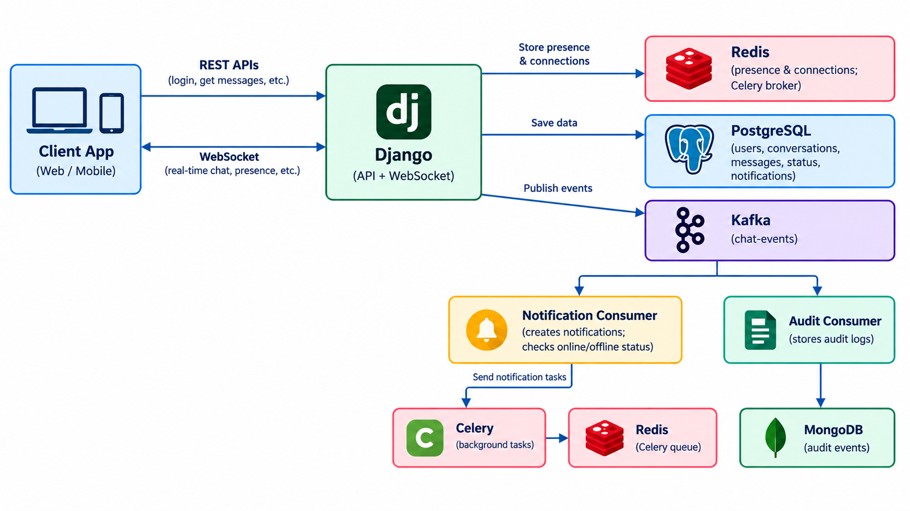

# Real-Time Chat Application System

The **Real-Time Chat Application System** is a backend application designed to enable real-time communication between authenticated users. It combines REST APIs and WebSockets to support user authentication, conversation management, message exchange, online presence tracking, and message delivery and read-status updates.

The application is developed using Django REST Framework and Django Channels, with PostgreSQL for persistent application data and Redis for tracking active WebSocket connections. Apache Kafka enables event-driven processing, while Celery handles asynchronous background tasks. MongoDB stores audit events for monitoring and traceability.
 
The system follows a modular architecture in which each component has a specific responsibility. Messages and related application records are persisted in PostgreSQL, real-time communication is handled through WebSockets, and Kafka consumers process notification-related and audit events independently.

## Architecture Diagram

The following diagram illustrates the interaction between the client, backend services, databases, and event-processing components.

**Architecture Diagram:**




## Technology Stack and Component Responsibilities

| Technology / Component | Responsibility                                                                    |
| ---------------------- | --------------------------------------------------------------------------------- |
| Python 3.12            | Core programming language for backend development                                 |
| Django 5.2             | Backend framework for application logic and database integration                  |
| Django REST Framework  | Provides REST APIs for authentication, conversations, messages, and notifications |
| Simple JWT             | Authenticates users through access and refresh tokens                             |
| Django Channels        | Handles WebSocket connections and real-time messaging                             |
| Daphne                 | ASGI server for serving HTTP and WebSocket traffic                                |
| PostgreSQL             | Stores users, conversations, messages, message statuses, and notifications        |
| Redis                  | Tracks active WebSocket connections and acts as the Celery message broker         |
| Apache Kafka           | Distributes message and status events to independent consumers                    |
| Celery                 | Executes asynchronous notification-processing tasks                               |
| MongoDB                | Stores audit events consumed from Kafka                                           |


## Essential APIs

All protected endpoints require a valid JWT access token in the `Authorization` header.

| Method | API Endpoint                                               | Purpose                                                     |
| ------ | ---------------------------------------------------------- | ----------------------------------------------------------- |
| POST   | `/api/token/`                                              | Authenticates a user and returns JWT tokens                 |
| POST   | `/api/token/refresh/`                                      | Obtains a refreshed access token                            |
| GET    | `/api/conversations/`                                      | Retrieves conversations available to the authenticated user |
| POST   | `/api/conversations/`                                      | Creates a new conversation                                  |
| POST   | `/api/conversations/<conversation_id>/members/`            | Adds a user to an existing conversation                     |
| GET    | `/api/conversations/<conversation_id>/messages/`           | Retrieves message history                                   |
| POST   | `/api/conversations/<conversation_id>/messages/send/`      | Sends a message through the REST API                        |
| GET    | `/api/conversations/notifications/`                        | Retrieves the authenticated user's notifications            |
| GET    | `/api/conversations/notifications/unread-count/`           | Retrieves the unread notification count                     |
| POST   | `/api/conversations/notifications/<notification_id>/read/` | Marks a notification as read                                |

### WebSocket Endpoint

| Endpoint                                         | Purpose                                                                                |
| ------------------------------------------------ | -------------------------------------------------------------------------------------- |
| `ws://127.0.0.1:8000/ws/chat/<conversation_id>/` | Establishes a WebSocket connection for real-time messaging and status acknowledgements |

WebSocket clients send message events and can acknowledge message delivery and reading without relying on repeated REST requests. Authentication must follow the mechanism configured in the application's WebSocket middleware.

## Data Storage and Responsibilities

| Storage Component | Stored Data / Responsibility                                                                                                        |
| ----------------- | ----------------------------------------------------------------------------------------------------------------------------------- |
| PostgreSQL        | Persistent relational data, including users, conversations, conversation memberships, messages, message statuses, and notifications |
| Redis             | Active WebSocket connection identifiers used to determine whether a user is online; also serves as the Celery broker                |
| Apache Kafka      | Message and status events published for asynchronous processing by independent consumers                                            |
| MongoDB           | Audit events processed by the audit consumer                                                                                        |
| Celery Worker     | Executes background notification-processing tasks using tasks delivered through Redis                                               |

### Data Flow Summary

* **PostgreSQL** is the primary source of persistent application data.
* **Redis** maintains transient online-presence information and supports background-task queuing.
* **Kafka** distributes application events without requiring the message-processing and audit consumers to perform their work in the original request.
* **MongoDB** stores audit records for later inspection.
* **Celery** processes scheduled background tasks; the current notification task logs processing activity rather than sending external notifications.

## Database Models

| Model                | Purpose                                                     |
| -------------------- | ----------------------------------------------------------- |
| `Conversation`       | Represents a conversation                                   |
| `ConversationMember` | Associates users with conversations                         |
| `Message`            | Stores message content, sender, conversation, and timestamp |
| `MessageStatus`      | Tracks delivery and read status for each recipient          |
| `Notification`       | Stores persistent user notification records                 |

### Model Relationships

* A conversation can have multiple members.
* A conversation can contain multiple messages.
* Each message belongs to a conversation and has a sender.
* Each recipient has a separate `MessageStatus` record for a message.
* Notifications associate users with messages and track notification read state.

## Installation

### Clone the Repository

```powershell
git clone https://github.com/yeswanthupputuri/scalable-chat-backend.git
cd scalable-chat-backend
```


## Future Improvements

* **Message History Optimization:** Introduce pagination, filtering, and search for conversations and messages.
* **Improved Presence Management:** Handle unexpected disconnects, reconnection, and stale Redis connection entries.
* **Reliable Event Processing:** Add retries, idempotent event handling, and dead-letter processing for Kafka consumers.
* **Enhanced Security:** Introduce rate limiting, stronger validation, and production-ready secret management.
* **Scalability Testing:** Evaluate concurrent WebSocket connections, message throughput, and background-task performance.
* **Monitoring and Observability:** Add structured logs, metrics, and health checks across services.
* **Additional Messaging Features:** Implement group-chat enhancements, message editing, deletion, and file attachments.

---

## Conclusion

The Scalable Real-Time Chat Backend demonstrates the integration of REST APIs, WebSockets, relational data storage, online-presence tracking, event-driven processing, and asynchronous task execution within a containerized backend application. It provides a foundation for exploring scalable messaging architectures and extending the system with more advanced communication features.
